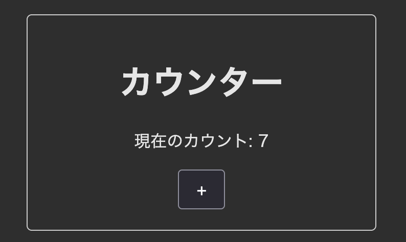

import Br from "#@/feature/talk/component/Br.astro";
import Wbr from "#@/feature/talk/component/Wbr.astro";
import TextCenter from "#@/feature/talk/component/TextCenter.astro";

## 自己紹介

- 所属：株式会社ゆめみ（入社：2023年4月）
- 職種：フロントエンドエンジニア
- 推し：La prière（特に棗いつきさん）

<TextCenter>
  <iframe
    width="560"
    height="315"
    src="https://www.youtube.com/embed/mAUE_YdymKo?si=XyPrs4ol401wkvI-"
    title="YouTube video player"
    frameborder="0"
    allow="accelerometer; autoplay; clipboard-write; encrypted-media; gyroscope; picture-in-picture; web-share"
    referrerpolicy="strict-origin-when-cross-origin"
    allowfullscreen
  ></iframe>
</TextCenter>

---

## はじめに

みなさんフレームワークは何を使っていますか？

<TextCenter>弊社では`React`と`Next.js`がほとんどです。</TextCenter>

---

## 自分の案件遍歴

### 現在

- `SvelteKit` + `Svelte`
- 一般消費者向けのECサイト

### 昨年

- `Astro` + `Svelte`
- SaaSの紹介サイト（ブログ付き）

---

### Svelteを<Wbr/>実際に使ってみてどうだったか？

---

## Svelteって？

<iframe src="https://svelte.jp/" />

---

<TextCenter>リアクティブ、コンパイラ、etc...</TextCenter>

<TextCenter>色々特徴はありますがざっくりまとめると</TextCenter>

<TextCenter>**いろんなライブラリのいいところどり**</TextCenter>

---

- ReactのHook
- Vueのテンプレート
- preactのSignal
- その他いろんなライブラリ
  - clsx
  - Framer Motion

[React使いが語るSvelteなら〇〇が要らない](http://www.totto2727.dev/talk/svelte-eliminates-the-need-for-hoge/article)

---

### 記法

<div class="flex">

```svelte
<script>
  // JavaScript
  let count = $state(0);

  function increment() {
    count += 1;
  }
</script>

<!-- HTMLっぽい独自テンプレート -->
<div class="counter">
  <h1>カウンター</h1>
  <p>現在のカウント: {count}</p>

  <div class="buttons">
    <button onclick={increment}>+</button>
  </div>
</div>

<!-- CSS -->
<style>
  /* ... */
</style>
```



</div>

---

```svelte
<!-- スタイリングの簡略化 -->
<div class={isCool ? "cool" : ""}>...</div>
<div class:cool={isCool}>...</div>

<div style:color="red">...</div>
<div style="color: red">...</div>
```

```svelte
<!-- CSS変数ネイティブな記法 -->
<Slider
	bind:value
	min={0}
	max={100}
	--track-color="black"
	--thumb-color="rgb({r} {g} {b})"
/>
```

---

```svelte
<!-- 便利なアニメーションヘルパー -->
<script>
import { fade } from "svelte/transition";

let visible = $state(false);
</script>

<button onclick={() => visible = !visible}>toggle</button>

{#if visible}
  <div transition:fade>fades in and out</div>
{/if}
```

---

```svelte
<!-- 依存配列の指定が不要 -->
<script>
let size = $state(50);
let color = $state("#ff3e00");

let canvas;

$effect(() => {
  const context = canvas.getContext("2d");
  context.clearRect(0, 0, canvas.width, canvas.height);

  // this will re-run whenever `color` or `size` change
  context.fillStyle = color;
  context.fillRect(0, 0, size, size);
});
</script>

<canvas bind:this={canvas} width="100" height="100" />
```

---

```svelte
<!-- 非同期処理が楽 -->
{#await promise}
	<!-- promise is pending -->
	<p>waiting for the promise to resolve...</p>
{:then value}
	<!-- promise was fulfilled or not a Promise -->
	<p>The value is {value}</p>
{:catch error}
	<!-- promise was rejected -->
	<p>Something went wrong: {error.message}</p>
{/await}
```

---

### UIライブラリ

- [Flowbite Svelte](https://flowbite-svelte.com/)
- [shadcn/ui](https://www.shadcn-svelte.com/)

### フォーム管理

- [Superform](https://superforms.rocks/)

---

## とはいえ辛い面も

---

### コミュニティがReactほど活発ではない

- 去年10月にメジャーアップデート！
- ただ現在もまだツールチェーンが対応しきれていない…
- Storybook
  - 一部プラグインがまだベータ版
- Flowbite Svelte
  - 一部のコンポーネントが適切に動作しない

<TextCenter>**自分たちもコミットするという強い意志が必要**（多分）</TextCenter>

---

### 実際に案件であった問題

#### <TextCenter>国際化のサーバサイド対応</TextCenter>

---

<div class="[&_img]:object-contain">
  
</div>

---

- ParaglideJSのような改善されたライブラリで解決
  - 辞書の形式が固有のため翻訳管理サービスとの相性があまり良くない
- シングルトンで管理されているのが問題
- Next.jsの`next-intl`ではリクエスト単位でスコープを分けて管理している

---

## もしSvelteを採用するなら

<TextCenter>Reactのように複数の有力な選択肢があるとは限らない</TextCenter>

<TextCenter>ライブラリの事前調査が重要</TextCenter>

---

## ではどんな場面で<Br/>Svelteを使っていくべきか？

---

### 最小限のセットアップで<Wbr/>一定の品質を実現したい場合

- 数ページの小規模なアプリケーション
- ひとまず動くプロトタイプを作りたい

<TextCenter>Svelteの基本機能ベースで開発をする</TextCenter>

<TextCenter>

逆に基本機能で収まらないことがわかってるなら

<Br />

採用するメリット薄いかも？

</TextCenter>

<TextCenter>例）Tanstack Queryによるキャッシュ管理</TextCenter>

---

## まとめ

- Webフロントエンドの開発ツール一式として<Wbr/>Svelteは非常に完成度が高い
- ただReactの方が既存の実装は豊富
- カスタマイズ性か、デフォルトの完成度のトレードオフ
- 今後の技術選定の一助になれば！


---

## ご清聴ありがとうございました！

<TextCenter>今日は紹介できなかったですが、Svelte以外にもAstroも長く触っていました。</TextCenter>

<TextCenter>`Astro` + `Svelte`や`Astro` + `React`などの構成が<Br/>気になる方はぜひお気軽にご質問ください！</TextCenter>

---

## 時間があったらやる枠

---

### Svelteのメタフレームワークは何が良い？

現状は以下の二つが有力候補

- SvelteKit
- Astro

---

### SvelteKit

- Svelte本体と同じ開発元が提供している
- Svelteにおけるデファクトスタンダート
- サーバサイドの機能はReact Routerに近い

---

### Astro

- 様々なUIライブラリを組み込めるメタフレームワーク
  - Svelteの他にもReactやVueも組み込める
- 記法はNext.jsのサーバコンポーネントに近い
- Astro自体はHTMLとCSS、バニラのJSの統合のみだが、<Wbr/>UIライブラリで動きのあるサイトを構築できる
